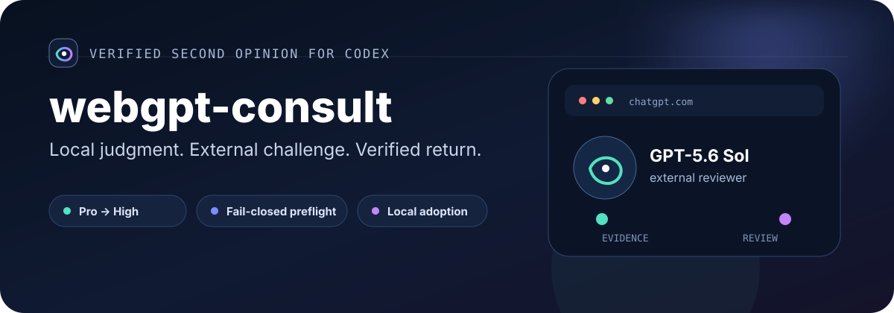
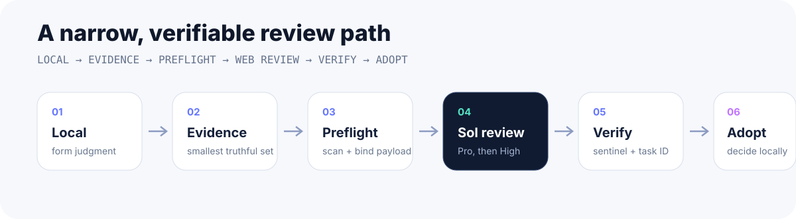
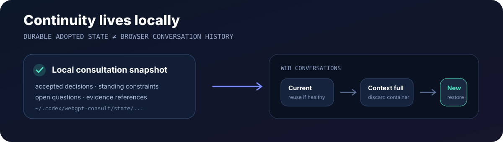

<p align="center">
  
</p>

<p align="center">
  <a href="README_en.md">English</a> ·
  <a href="SKILL.md">Skill 规范</a> ·
  <a href="README_Agent.md">AI Agent 指引</a>
</p>

`webgpt-consult` 是一个 Codex Skill。遇到架构、调试、产品、商业、风险或文件审查这类复杂问题时，本地 Codex 先形成自己的判断，再通过 Codex Chrome plugin 把经过整理的真实证据交给 ChatGPT Web 的 GPT-5.6 Sol 做第二意见审查。外部结果经过验证后回到本地，由 Codex 决定采纳、拒绝或修改。

<p align="center">
  
</p>

## 两种审查方式

`independent` 用于完整 deep review、里程碑 review、对抗性审查、架构重审，或者明显不同的问题。它会创建新的 ChatGPT 会话。本地 Codex 会先形成判断，但默认不会把结论告诉 Sol，从而减少锚定。

`follow-up` 只用于明确继续同一条 consultation 的情况。用户明确要求继续，或者存在唯一明确的 PR、issue、branch、artifact 等 anchor 时，可以复用已有 Web 会话。

匹配有歧义时直接 fresh。串错 consultation 的风险高于重复少量上下文的成本。

## 会话连续性

长期状态保存在本地：

```text
~/.codex/webgpt-consult/state/<project-id>/<consult-id>.json
```

每个 snapshot 只保存本地已经采纳、仍然值得复用的状态，例如用户目标、长期约束、已接受决策、已否决路径、未决问题、证据引用和当前项目状态。

Web ChatGPT conversation 只是执行容器。旧会话打不开、上下文过长、明显忘记关键决策，或者继续使用会降低可靠性时，Codex 会创建新会话，并使用本地 snapshot 加当前增量和当前证据恢复同一个 consultation。

<p align="center">
  
</p>

查看当前 checkout 的 consultation：

```bash
python3 scripts/consult_state.py --project-root . list
```

项目 identity 包含当前 checkout 路径，因此不同 clone 或 worktree 不会静默共享 consultation state。

## 安全和验证

以下边界 fail closed：

- GPT-5.6 Sol 模型身份无法验证
- Pro 和 High 都不可用
- packet 或文本附件发现 executable credential
- 必需证据没有真实发送
- 结果 sentinel 和 task ID 无法精确绑定

发送前运行统一 preflight：

```bash
python3 scripts/submission_preflight.py packet.md \
  --task-id webgpt-consult-... \
  --sentinel WEBGPT_CONSULT_RESULT_... \
  --attachment ./src/example.py
```

二进制附件需要本地检查后才能显式使用 `--confirm-unscanned-binary`。这个确认不会覆盖已检测到的凭证。

模型路由固定为：

```text
verified GPT-5.6 Sol Pro
      ↓ unavailable / disabled / ambiguous / not actionable
verified GPT-5.6 Sol High
      ↓ unavailable
fail closed
```

外部回复必须以前两行开始：

```text
WEBGPT_CONSULT_RESULT_<unique-id>
Task-ID: <task-id>
```

`scripts/result_verifier.py` 会验证最新 assistant turn。sentinel 只在正文中出现不算完成。

## 快速开始

要求：Python 3.10+、Codex、已连接的 Codex Chrome plugin、Chrome 中已登录 ChatGPT Web，并且账号实际提供 GPT-5.6 Sol Pro 或 High。

如果你的 Codex 环境使用 Skills CLI，可以安装：

```bash
npx skills add R-jed/webgpt-consult -g -y
```

重启或新建 Codex 任务后，显式调用：

```text
Use $webgpt-consult to get a strict GPT-5.6 Sol review of this architecture.
```

也可以直接 clone 源码并通过你的 Codex Skill / Plugin 安装机制加载完整目录。仅 `git clone` 不会自动完成 Skill 注册。

没有 OpenCLI fallback。Chrome plugin 不可用时，Skill 会停止。

## 发布结构

```text
webgpt-consult/
├── SKILL.md
├── README.md
├── README_en.md
├── README_Agent.md
├── LICENSE
├── agents/
│   └── openai.yaml
├── assets/
│   └── readme/
│       ├── hero.svg
│       ├── workflow.svg
│       └── continuity.svg
├── references/
│   ├── chrome-workflow.md
│   └── context-packet-template.md
└── scripts/
    ├── build_attachment_bundle.py
    ├── check_packet_safety.py
    ├── consult_state.py
    ├── model_router.py
    ├── result_verifier.py
    └── submission_preflight.py
```

AI Agent 请从 [README_Agent.md](README_Agent.md) 开始，并以 [SKILL.md](SKILL.md) 为执行规范。

## License

[MIT](./LICENSE)
