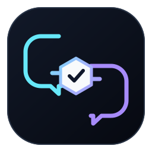

<p align="center">
  
</p>

<h1 align="center">webgpt-consult</h1>
<p align="center">Codex → Chrome → ChatGPT Web</p>

`webgpt-consult` 是一个轻量 Codex Skill，让 Codex 通过 Chrome 调用 ChatGPT Web 中的 GPT-5.6 Sol Pro 或 High。

它负责浏览器连接、模型边界、会话连续性、会话绑定、浏览器资源生命周期和基础敏感信息保护。具体咨询什么、怎么写 prompt、上传哪些源码或文件，由当前 Codex 根据用户请求决定。

> **AI Agent 请先阅读 [README_Agent.md](README_Agent.md)。实际执行以 [skills/webgpt-consult/SKILL.md](skills/webgpt-consult/SKILL.md) 为准。**

## 安装

要求：

- Codex
- Codex Chrome plugin 已连接
- Chrome 已登录 ChatGPT Web
- ChatGPT Web 中可使用 GPT-5.6 Sol Pro 或 High
- Python 3.10+，仅用于本地安全检查

项目级安装：

```bash
npx skills add R-jed/webgpt-consult
```

跨项目全局安装到 Codex：

```bash
npx skills add R-jed/webgpt-consult -g -a codex
```

更新：

```bash
npx skills update webgpt-consult
```

全局安装时可加 `-g`。

## 使用

显式调用：

```text
/webgpt-consult <你的咨询请求>
```

例如：

```text
/webgpt-consult 请检查这个架构方案有没有明显风险。
```

```text
/webgpt-consult 请让 GPT-5.6 Sol 阅读相关源码并分析这个 bug 的根因。
```

```text
/webgpt-consult 继续刚才的 Web 咨询，重点看我刚补充的实现结果。
```

Skill 不要求固定的咨询模板。Codex 可以根据任务直接组织 prompt，也可以上传必要的源码、日志、文档、截图或其他文件。

对于代码问题，默认应选择足够解决当前问题的源码范围。可以上传相关文件，也可以直接提供相关代码片段，没有必要为了方便上传整个仓库。

## 工作方式

```text
用户请求
  → Codex 组织当前咨询内容
  → 基础敏感信息检查
  → Chrome
  → GPT-5.6 Sol Pro
     或 Pro 不可用时 High
  → 验证本轮返回结果
  → 回到当前 Codex 任务
```

如果用户明显在继续同一条咨询，Skill 会优先复用当前 Codex 会话中已经验证的 Web conversation。绑定无法可靠确认时，会使用新的 ChatGPT conversation。

如果当前 Web conversation 已经过长，Codex 可以使用 `Branch in new chat` 保留仍然有用的上下文，或者直接开始新会话。

这些 Web binding 只存在于当前 Codex conversation，不写入项目、数据库或长期缓存。

## 浏览器资源

Skill 只会自动清理由它在当前 Codex conversation 中明确创建、并且仍能通过精确 handle 确认的旧 tab。

用户原本打开的 Chrome / ChatGPT tabs、ownership 不明确的 tabs 和正在生成内容的 tabs 不会被自动关闭。

项目不会使用 `pkill`、`killall`、Chrome 进程扫描、后台 cleanup daemon 或持久化 tab registry。

## 隐私与安全

Skill 内保留一个小型本地安全门，用于阻断高置信度的：

- API keys 和常见 provider tokens
- passwords 和 authentication secrets
- cookies、session tokens、Authorization headers
- private keys
- OTP / recovery codes
- 支付卡号、CVV / CVC、payment PIN

这项检查只处理不能合理发送给 WebGPT 的明显 secrets/auth/payment credentials，不尝试建立复杂的 PII/DLP 系统。

Codex 仍应在发送前做 data minimization，删除与当前咨询无关的姓名、邮箱、地址、内部信息或其他私人上下文。

所有即将发送的 UTF-8 prompt 文本和 UTF-8 文本附件都应先通过安全检查：

```bash
python3 <SKILL_ROOT>/scripts/safety_guard.py prompt.txt src/example.py
```

发现高风险内容时先在本地删除或脱敏，再重新检查。不要绕过安全门。

## 模型边界

Web 端只接受：

```text
GPT-5.6 Sol Pro
  → unavailable
GPT-5.6 Sol High
  → unavailable
stop
```

Codex 自己界面中的模型名称和 reasoning level 不参与 WebGPT model verification。

## 项目结构

```text
skills/webgpt-consult/
├── SKILL.md
├── LICENSE
├── agents/
│   └── openai.yaml
├── assets/
│   └── logo.svg
├── references/
│   └── chrome-workflow.md
└── scripts/
    └── safety_guard.py
```

详细执行规则见 [SKILL.md](skills/webgpt-consult/SKILL.md)。

English: [README_en.md](README_en.md)

## License

[MIT](LICENSE)
