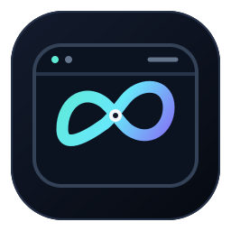

<p align="center">
  
</p>

<h1 align="center">webgpt-consult</h1>
<p align="center">Codex → Chrome → ChatGPT Web</p>

`webgpt-consult` lets Codex use GPT-5.6 Sol Pro or High through ChatGPT Web in Chrome.

You tell Codex what you want a second pair of eyes on. Codex works out what context is useful, attaches relevant source files, logs, or documents when needed, and brings the Web answer back into the current task. The Skill keeps the browser flow reliable, preserves useful conversation continuity, verifies the Web model, and performs a basic local safety check before sending text.

> **AI agents should read [README_Agent.md](README_Agent.md) first. Runtime behavior is defined by [skills/webgpt-consult/SKILL.md](skills/webgpt-consult/SKILL.md).**

## Install

You need Codex, the Codex Chrome plugin connected, ChatGPT Web signed in, and GPT-5.6 Sol Pro or High available on the Web side.

Install for the current project:

```bash
npx skills add R-jed/webgpt-consult
```

Install globally for Codex:

```bash
npx skills add R-jed/webgpt-consult -g -a codex
```

Update:

```bash
npx skills update webgpt-consult
```

Add `-g` when updating a global install.

## Use

```text
/webgpt-consult <your consultation request>
```

For example:

```text
/webgpt-consult Ask GPT-5.6 Sol to investigate this login bug and inspect the relevant source and logs if needed.
```

There is no fixed consultation template. For code work, Codex can upload the relevant files or send only the important excerpts. It decides how much context the current question actually needs.

## Example

Suppose you have been stuck on a login bug:

```text
/webgpt-consult I have been chasing this login issue for a while. Ask GPT-5.6 Sol to help find the root cause.
```

Codex first looks at the current project and picks the material that matters, such as `auth.py`, `session.py`, and the error log. It checks outgoing text locally for obvious secrets, then opens ChatGPT Web through Chrome and uses GPT-5.6 Sol Pro when available, with High as the fallback.

After GPT-5.6 Sol reviews the material, Codex verifies that the reply belongs to this consultation and brings the answer back into the task. If you keep discussing the same issue, the Skill will reuse the current Web conversation when it can verify it safely. Otherwise it starts a fresh one.

## Privacy and safety

Before text is sent to the Web, the Skill locally blocks common API keys, passwords, access tokens, cookies or session data, private keys, one-time codes, and payment-card details. If something sensitive is found, sending stops until that value is removed or redacted.

Names, email addresses, physical addresses, and other private details that are unrelated to the question should also be left out. The safety check is deliberately small and practical rather than a full privacy-auditing system.

## Model

The Web side uses only:

```text
GPT-5.6 Sol Pro
  ↓ unavailable
GPT-5.6 Sol High
  ↓ unavailable
stop
```

The model or reasoning level currently selected in Codex does not affect Web model selection.

## Package layout

```text
skills/webgpt-consult/
├── SKILL.md
├── LICENSE
├── agents/
│   └── openai.yaml
├── assets/
│   └── webgpt-consult.svg
├── references/
│   └── chrome-workflow.md
└── scripts/
    └── safety_guard.py
```

See [SKILL.md](skills/webgpt-consult/SKILL.md) for the detailed runtime rules.

中文: [README.md](README.md)

## License

[MIT](LICENSE)
