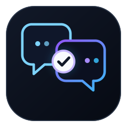

<p align="center">
  
</p>

<h1 align="center">webgpt-consult</h1>
<h3 align="center">GPT-5.6 Sol Pro / High second-opinion Skill for Codex</h3>

<p align="center">Judge locally · Review on the Web · Verify the result · Adopt locally</p>

<p align="center">
  
  
  <a href="LICENSE"></a>
  <a href="https://github.com/R-jed/webgpt-consult/stargazers"></a>
</p>

<p align="center">
  <a href="#about">About</a> ·
  <a href="#quick-start">Quick start</a> ·
  <a href="#usage">Usage</a> ·
  <a href="#safety-and-verification">Safety</a> ·
  <a href="#key-files">Key files</a> ·
  <a href="README.md">中文</a>
</p>

<a id="about"></a>

## About

> **AI agents should read [README_Agent.md](README_Agent.md) first, then treat [SKILL.md](SKILL.md) as the execution contract.**

`webgpt-consult` lets Codex obtain a verified second opinion from GPT-5.6 Sol Pro or High through ChatGPT Web when a problem deserves a stronger independent review.

Local Codex owns task understanding, evidence selection, and the initial judgment. WebGPT reviews the problem. After the external result is verified, Codex decides locally what to adopt, reject, or modify.

```text
user task
  → local Codex judgment
  → choose independent / follow-up
  → assemble truthful context and evidence
  → credential / attachment preflight
  → ChatGPT Web
  → GPT-5.6 Sol Pro, otherwise High
  → sentinel + task ID verification
  → local adoption decision
  → optional local consultation-state update
```

Why this project exists:

- difficult architecture, debugging, product, and risk decisions often benefit from an independent strong-model review
- blindly sending local context to the Web creates privacy, evidence-integrity, and model-identity risks
- Web conversations eventually become long, unavailable, or unreliable, so reusable consultation state is kept locally

<a id="quick-start"></a>

## Quick start

### Requirements

- Python 3.10+
- a current Codex version
- Codex Chrome plugin installed and connected
- ChatGPT Web signed in in Chrome
- an account that actually exposes GPT-5.6 Sol Pro or High

### Recommended install

Current Codex versions include the built-in `/skill-installer`. Run this inside Codex:

```text
/skill-installer install https://github.com/R-jed/webgpt-consult
```

The installer places the complete Skill in the Codex skills directory. With the default `CODEX_HOME`, this is typically:

```text
~/.codex/skills/webgpt-consult/
```

After installation, restart Codex and open a new task so the Skill is reloaded.

If `/skill-installer` is missing, update Codex first. `webgpt-consult` depends on the Codex Chrome plugin, so this project does not maintain a separate installer for older Codex versions.

> `git clone` is for reading or developing the source only. Cloning the repository does not register the Skill with Codex.

### First use

Implicit invocation is disabled. Invoke the Skill explicitly with `/webgpt-consult`:

```text
/webgpt-consult Perform an independent GPT-5.6 Sol architecture review of this project.
```

You can put the exact review goal directly after the Skill name:

```text
/webgpt-consult Check this fix for overlooked architectural risks and return a second opinion.
```

There is no OpenCLI fallback. The Skill stops when the Chrome plugin is unavailable.

<a id="usage"></a>

## Usage

### Review modes

| Mode | Best for | Web conversation |
|---|---|---|
| `independent` | deep review, milestone review, adversarial review, architecture reset, materially different questions | fresh conversation |
| `follow-up` | a clear continuation of one consultation with a unique anchor | may reuse the existing conversation |

In `independent` mode, local Codex forms its own judgment first but normally keeps that conclusion private from Sol to reduce anchoring.

`follow-up` reuses an old conversation only when continuity is unambiguous. If the match is uncertain, the Skill starts fresh.

### Consultation continuity

Durable consultation state is stored locally:

```text
~/.codex/webgpt-consult/state/<project-id>/<consult-id>.json
```

A snapshot contains only locally adopted reusable state such as:

- user intent and standing constraints
- accepted decisions
- rejected or deferred paths
- open questions
- evidence references
- current project state

It does not store a full transcript and does not treat raw Sol output as project truth.

If the old Web conversation is unavailable, context-limited, or visibly unreliable, Codex creates a fresh conversation and restores the same consultation from the local snapshot plus the current delta and current evidence.

List consultations for the current checkout with:

```bash
python3 scripts/consult_state.py --project-root . list
```

<a id="safety-and-verification"></a>

## Safety and verification

These boundaries fail closed:

- GPT-5.6 Sol model identity cannot be verified
- neither Pro nor High is usable
- executable credentials are detected in the packet or transmitted text attachments
- required evidence was not actually uploaded
- the final reply cannot be bound to the exact sentinel and task ID

Run preflight immediately before Send:

```bash
python3 scripts/submission_preflight.py packet.md \
  --task-id webgpt-consult-... \
  --sentinel WEBGPT_CONSULT_RESULT_... \
  --attachment ./src/example.py
```

Non-text attachments require local review before `--confirm-unscanned-binary` may be used. That confirmation never overrides a detected credential finding.

Model routing is fixed:

```text
verified GPT-5.6 Sol Pro
      ↓ unavailable / disabled / ambiguous / not actionable
verified GPT-5.6 Sol High
      ↓ unavailable
fail closed
```

The external reply must begin with:

```text
WEBGPT_CONSULT_RESULT_<unique-id>
Task-ID: <task-id>
```

`scripts/result_verifier.py` verifies the latest assistant turn. A sentinel appearing later in prose does not count.

<a id="key-files"></a>

## Key files

| File | Purpose |
|---|---|
| [SKILL.md](SKILL.md) | authoritative Skill execution contract |
| [README_Agent.md](README_Agent.md) | AI-agent discovery and reading entry point |
| [agents/openai.yaml](agents/openai.yaml) | display metadata and invocation policy |
| [references/chrome-workflow.md](references/chrome-workflow.md) | ChatGPT Web browser workflow |
| [references/context-packet-template.md](references/context-packet-template.md) | consultation context template |
| [scripts/consult_state.py](scripts/consult_state.py) | local consultation-state management |
| [scripts/model_router.py](scripts/model_router.py) | Pro → High identity and routing policy |
| [scripts/submission_preflight.py](scripts/submission_preflight.py) | pre-send safety and attachment checks |
| [scripts/result_verifier.py](scripts/result_verifier.py) | exact external-result binding |

### Repository layout

```text
webgpt-consult/
├── README.md
├── README_en.md
├── README_Agent.md
├── SKILL.md
├── LICENSE
├── assets/
│   └── logo.svg
├── agents/
│   └── openai.yaml
├── references/
│   ├── chrome-workflow.md
│   └── context-packet-template.md
└── scripts/
    ├── build_attachment_bundle.py
    ├── check_packet_safety.py
    ├── consult_state.py
    ├── model_router.py
    ├── result_verifier.py
    └── submission_preflight.py
```

## License

[MIT](./LICENSE)
